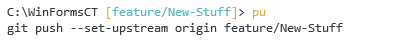

# pu-br

This repository holds a single PowerShell file containing a few helpful functions, which are:

### Push-Upstream `pu`
Dynamically builds and invokes the full git command to push to a new upstream:

### Browse-Remote `br`
Dynamically builds the remote URL of the current branch and opens it with the default browser:

### Push-Upstream-And-Browse-Remote `pubr`
Chains both of the prior commands. This comes very handy if you are pushing new branches regularly to create Pull-Requests afterwards in the web UI of your repository.

It pushes your local commits to a new upstream branch and opens the web UI afterwards from which you should be able to create a Pull-Request with just a few mouse clicks.
